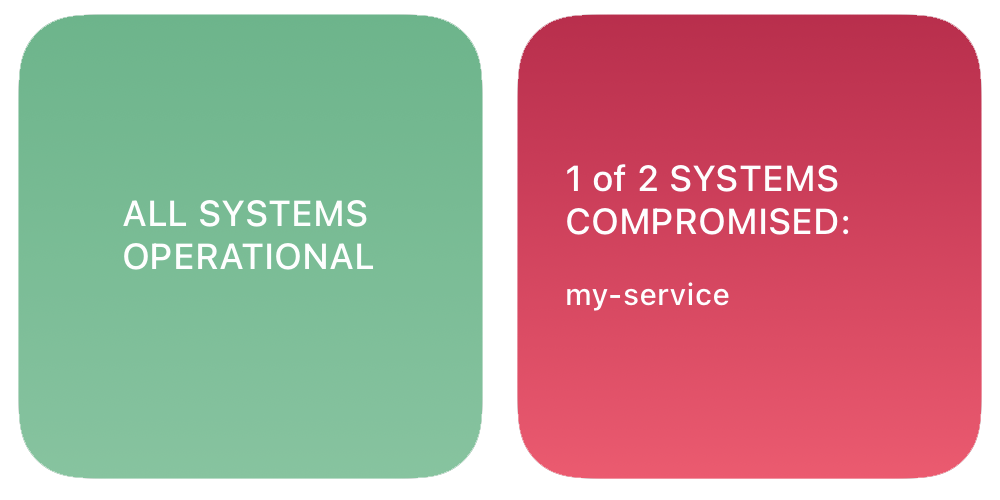

# Scriptable DevOps Monitoring Widget

A [scriptable](https://www.scriptables.de) widget for monitoring your services/websites and give you peace of mind 🧘🏻‍♂️.



## Usage

1. Download `script.js` to you iCloud _scriptable_ directory. It will be synced onto your device.
2. Add your services and tests to the top of the file.
3. Add a small _scriptable_ widget to your home screen. See _scriptable_ docs, if help is needed.

### How to add your services

```
const services = [
    {
        name: "my-service",
        path: "https://example.com/api",
        type: "json",
        test: () => true
    }
];
```

| property | description                                                                                    |
| -------- | ---------------------------------------------------------------------------------------------- |
| name     | Display name of your service/site                                                              |
| path     | Url of endpoint to check                                                                       |
| type     | Tells the script how to parse the response for you: `undefined` (not at all), `json`, `string` |
| test     | A function to test your API. Must return true/false                                            |
